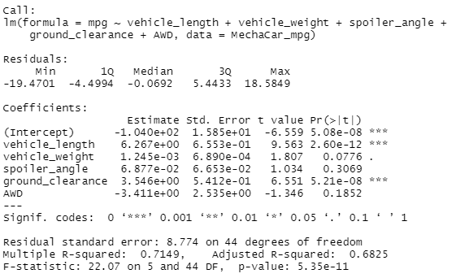
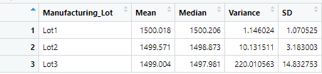
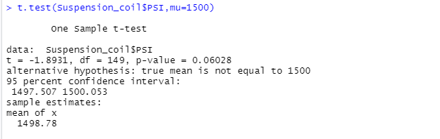
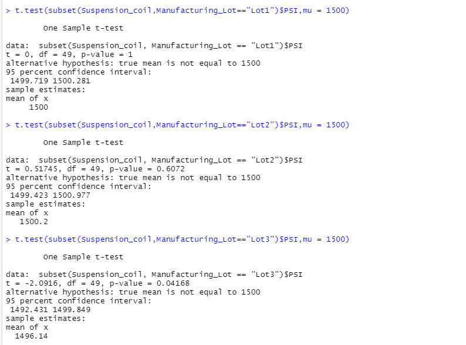

# MechaCar_Statistical_Analysis

## Project Overview
Review production data for insights that may help the manufacturing team.

### Objectives

- Perform multiple linear regression analysis to identify which variables in the dataset predict the mpg of MechaCar prototypes
- Collect summary statistics on the pounds per square inch (PSI) of the suspension coils from the manufacturing lots
- Run t-tests to determine if the manufacturing lots are statistically different from the mean population
- Design a statistical study to compare vehicle performance of the MechaCar vehicles against vehicles from other manufacturers.

## Resources
- The `MechaCar_mpg.csv` dataset (within the `MechaCarAnalysis/Resources` folder) contains mpg test results for 50 prototype MechaCars. The MechaCar prototypes were produced using multiple design specifications to identify ideal vehicle performance. Multiple metrics, such as vehicle length, vehicle weight, spoiler angle, drivetrain, and ground clearance, were collected for each vehicle. 
- The MechaCar `Suspension_Coil.csv` (within the `MechaCarAnalysis/Resources` folder) dataset contains the results from multiple production lots. In this dataset, the weight capacities of multiple suspension coils were tested to determine if the manufacturing process is consistent across production lots
- The `MecaCarAnalysis` folder also contains the RStudio code for this analysis titled `MechaCarChallenge.R`

## Results

Results from the various statistical analyses conducted in RStudio.

## Linear Regression to Predict MPG

The results of the linear regression model indicate that a vehicle's length and ground clearance (as well as intercept) are statistically likely to provide non-random amounts of variance to the mpg values in the dataset, or that the length and ground clearance affect mpg. Though the p-value of the vehicle weight indicates it is not statistically significant, the low p-value signifies it could play a factor in mpg, but more analysis or data is needed.

The slope of the linear model is not zero because each dependent value is not determined by random chance and/or error and the slope can be used for predictive modeling.

The r-squared value represents how well the regression model approximates the data points. In this case, the r-squared value displays that this model describes about 71 percent of the mpg for this dataset, which I would say is fairly effective. If we wanted to increase the effectiveness, we might want to look at including other factors. The low p-value also shows that my formula describes the data accurately.

## Summary Statistics on Suspension Coils

The design specifications for the MechaCar suspension coils dictate that the variance of the suspension coils must not exceed 100 pounds per square inch.

 Our outputs show that it meets the specification when it is aggregated in total. But, when the data is broken down by individual lot, Lots 1 and 2 meet the specification, but Lot 3 does not meet the specification because the variance of the suspension coils in Lot 3 exceed 100 pounds.

Summary of aggregated data:

Data broken down by individual lot:

## T-Tests on Suspension Coils

To determine if the PSI across all manufacturing lots is statistically different from the population mean of 1,500 pounds per square inch, I wrote and executed the following code in RStudio:

The output, as shown above, indicates that the p-value is more than the significance level 0.05 and therefore the mean weight of the PSI across all manufacturing lots is not statistically different from the population mean of 1,500 pounds per square inch.

To find out whether the PSI for each manufacturing lot is statistically different from the population mean of 1,500 pounds per square inch, I then ran the following code:

The results shown indicate that the PSI for manufacturing lots 1 and 2 are not statistically different from the population mean of 1,500 PSI. However, Lot 3 has a statistically different mean suspension coil PSI from the population mean.

## Study Design: MechaCar vs Competition

To quantify how the MechaCar performs against the competition, I would suggest comparing MechaCar metrics to the metrics from an electric vehicle.

We could compare cost, fuel efficiency, safety rating and maintenance cost.

To do so, we could set up two sample t-tests to see if there are statistical differences between the distribution means between MechaCar metrics and electric vehicle metrics for the factors we've chosen to look at, and then delve more into why those means might exist with further testing.

The null hypothesis for the two sample t-test is that the two groups are equal.

To run this test, we would need data for an electric vehicle and the MechaCar vehicle. What I would look at for the electric vehicle is data on Tesla car models and data on MechaCars. The data would need to contain information about cost, fuel efficiency, safety ratings and maintenance costs. We can then compare across categories using two-sample t-tests.